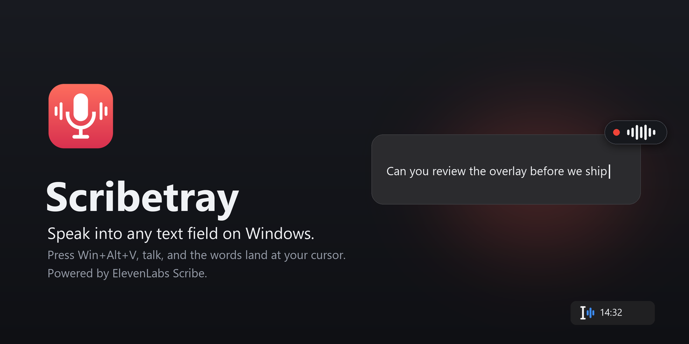
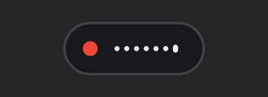
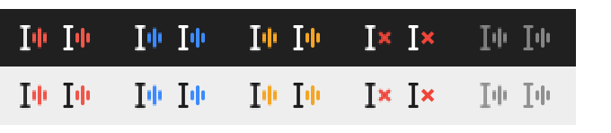

<p align="center">
  
</p>

<p align="center">
  <b>Press a hotkey, talk, and your words appear where your cursor is.</b><br>
  A tiny Windows tray app powered by <a href="https://elevenlabs.io/speech-to-text">ElevenLabs Scribe</a>.
</p>

<p align="center">
  
  
  
</p>

---

Typing a long prompt to an AI agent, answering a chat, writing a commit message: most of what we type we could just *say*. Scribetray lets you do that in any app, without switching windows or copying anything.

1. Put your cursor in a text field.
2. Press **Win+Alt+V** and speak. A small waveform floats next to your cursor so you know it's listening.
3. Press **Win+Alt+V** again. A moment later the text is typed in, right where you left it.

Press **Enter** instead to insert the text *and send it*, which is handy in chat boxes and AI prompts. Press **Esc** to throw the recording away.

<p align="center">
  
</p>

## Why Scribetray

- **Works everywhere you type.** Browsers, Electron apps, editors, chat clients. Scribetray types the text as keystrokes into the field that had focus when you started, so it doesn't depend on per-app integrations.
- **Your clipboard stays yours.** Text is typed, not pasted. A paste mode exists for the rare field that prefers it, and it restores your clipboard afterwards.
- **Nothing gets lost.** If you switched windows while it was transcribing, the text goes to the clipboard instead of into the wrong app. The last recordings stay on disk, so a failed upload can be retried and **one click on the tray icon** copies your last dictation.
- **Honest about what it did.** By default every dictation starts with 🎙️, so whoever reads it (a colleague, or an AI agent) knows it was spoken and may contain a transcription slip. You can turn this off in the menu.
- **Accurate in many languages.** Scribe auto-detects the language, or you can pin one from the menu.
- **Small and quiet.** A single native executable. No installer, no admin rights, no background service, no telemetry.

## Get started

### 1. Get an ElevenLabs API key

Scribetray uses your own ElevenLabs account, so there is no subscription to Scribetray itself.

1. [Sign up at ElevenLabs](https://elevenlabs.io/app/sign-up). The free plan includes 10,000 credits a month, enough to try Scribetray properly.
2. Open **Developers → API Keys → Create API key**.
3. Turn on **Restrict key** and enable only:
   - **Speech to Text**, required.
   - **User → Read**, optional. It lets the tray menu show how much of your monthly allowance you've used.

### 2. Download and run

Download `scribetray.exe` from the [latest GitHub release](https://github.com/colthreepv/scribetray/releases/latest) and put it somewhere permanent, for example `%LOCALAPPDATA%\Programs\Scribetray\`. Then run it.

> [!NOTE]
> The executable isn't code-signed yet, so Windows SmartScreen may warn you the first time. Choose **More info → Run anyway**. You can also [build it yourself](#build-from-source).

### 3. Add your key

The tray icon appears faded until Scribetray has a key. Right-click it, choose **Set API key…**, and paste the key into `api_key = "..."`. Save the file and you're done; Scribetray picks up the change immediately.

Alternatively, set the `ELEVENLABS_API_KEY` environment variable.

## Everyday use

| Key | While idle | While recording |
|---|---|---|
| **Win+Alt+V** | Start recording | Stop and insert |
| **Enter** | (untouched) | Stop, insert, and send |
| **Esc** | (untouched) | Cancel |

**The tray icon** shows what's happening: a coral wave when ready, blue while recording, amber while transcribing, and a red × if something failed.

<p align="center">
  
</p>

- **Left-click** the icon to copy your last dictation, or to retry it if it failed.
- **Right-click** for the menu. From there you can choose the microphone and language, browse recent dictations, switch to push-to-talk, and change the hotkey. It also shows your ElevenLabs usage for the month.

The tray menu also shows cached monthly usage and an estimate of remaining batch transcription time. Set `scribe_credits_per_hour` to tune that estimate; realtime usage is excluded.

Scribetray listens only while recording. In realtime mode, audio streams to ElevenLabs as you speak; in batch mode, it is uploaded when you stop. Enter and Esc are claimed *only* while a recording is running.

## What does it cost?

Scribetray is free and open source. Transcription is billed by ElevenLabs to your account. The free plan's monthly credits are enough to try it out, and after that Scribe costs roughly **$0.22 per hour of audio** on pay-as-you-go. A typical 30-second dictation costs a fraction of a cent. Current prices are on [ElevenLabs' pricing page](https://elevenlabs.io/pricing).

## Privacy

- Audio is sent to ElevenLabs only when you record, and only for transcription. See ElevenLabs' [privacy policy](https://elevenlabs.io/privacy-policy).
- Your last 20 recordings (audio and text) are kept on your PC in `%LOCALAPPDATA%\Scribetray\history`, so that nothing is lost when something fails. Delete that folder any time.
- Your API key is stored in plain text in `%APPDATA%\Scribetray\config.toml`. A restricted key limits what it can do if it ever leaks.
- Scribetray talks only to ElevenLabs: transcription requests, plus a monthly usage check if your key allows it.

## Settings

Most options are in the tray menu. Everything else lives in `%APPDATA%\Scribetray\config.toml`, which reloads automatically when you save it:

```toml
api_key = ""               # or set ELEVENLABS_API_KEY
hotkey = "Win+Alt+V"       # letters, digits, F1–F24, Space, Tab… with Win/Alt/Ctrl/Shift
mode = "toggle"            # or "push_to_talk": hold the hotkey while you speak
model = "scribe_v2"
language = "auto"          # or a language code such as "ita" or "eng"
prefix = "🎙️ "
prefix_enabled = true
auto_enter = false         # also press Enter after every dictation
insert_method = "type"     # or "paste"
restore_clipboard = true
max_seconds = 600          # a recording stops by itself after 10 minutes
scribe_credits_per_hour = 585 # estimated batch Scribe credits per recording hour
microphone = ""            # blank uses the Windows default input device
realtime = false           # stream audio while you talk (costs more)
keyterms = []              # words Scribe should expect, e.g. ["Scribetray", "Kubernetes"]
sound_cues = true
start_with_windows = false
```

## Good to know

- **Windows only**, by design: it relies on Windows APIs for hotkeys, caret tracking, and typing. It has been tested mostly on Windows 11.
- **Apps running as administrator** can't receive typed text from a normal app (a Windows security rule). Run Scribetray as administrator too if you need that.
- **The waveform follows your text cursor** in most apps. Where an app doesn't expose its cursor, it appears next to the mouse pointer instead.
- **Terminals and games** may not handle typed Unicode text well. Paste mode can help.

## Build from source

You need Rust 1.85+ with the MSVC toolchain.

```powershell
git clone https://github.com/colthreepv/scribetray
cd scribetray
cargo build --release --locked
.\target\release\scribetray.exe
```

To run your own builds day to day, `scripts/deploy-latest.ps1` builds, keeps a few versioned copies, and points a stable `latest` path at the newest one. See [docs/development.md](docs/development.md).

## License

Scribetray is distributed under the [Do What The Fuck You Want To Public License, Version 2 (WTFPL)](LICENSE). It is an independent project and is not affiliated with or endorsed by ElevenLabs.
