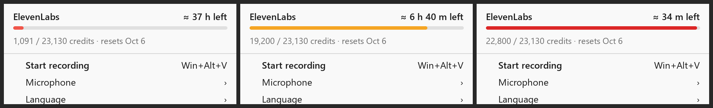

# Scribetray — usage header (v0.6)

Everything in the v0.5 plan has shipped (`7416b4f`, `255b6c4`): the usage line, the final-minute countdown, and the hollow push-to-talk dot. This file lists only what is still open. Implement it as written, in this order.

## 1. Bug: the usage line disappears after the first menu open

Cause: the usage text lives in `UiSettings::subscription_line`. The UI thread sets it on `UiCommand::SetSubscriptionLine`, but `main.rs` builds `ui_settings` with `subscription_line: None` (`make_ui_settings`) and never updates it. Every menu toggle (`handle_ui_event` → `UiCommand::SetSettings`) and every config reload sends that copy, and `apply_command` replaces `self.settings` wholesale, so the line is wiped. The cache in `SubscriptionCache` still counts as fresh, so nothing refetches for 10 minutes and the menu shows no line.

Fix: move usage out of `UiSettings` into its own `UiState` field (`usage: Option<UsageSnapshot>`), set only by the usage command. `SetSettings` must not touch it. Remove `subscription_line` from `UiSettings`.

Accept: open the menu, toggle any option, and reopen it; the usage header is still there. Editing the config file keeps the last value visible until the forced refresh replaces it. The one intended exception is a changed `api_key`, which clears it.

## 2. Structured usage and batch hours remaining

Send data, not a preformatted string: `UiCommand::SetUsage(Option<UsageSnapshot>)` with

```rust
pub struct UsageSnapshot {
    pub used: u64,             // character_count
    pub limit: u64,            // character_limit
    pub reset_unix: Option<i64>,
    pub overage: Option<String>, // only when non-zero
}
```

The UI derives every displayed value from it.

**Hours remaining (batch Scribe only)** = `(limit − used) / scribe_credits_per_hour`.

- New config key `scribe_credits_per_hour`, default **585**. This was measured on this account (pay-as-you-go). On 2026-09-28, 271 s of batch recordings cost 44 `scribe_v2` credits in `/v1/usage/character-stats` (`breakdown_type=model`, hourly), which is 0.162 credits/s. The rate depends on the plan (the Free plan is far more expensive per minute), so it must stay configurable. Realtime costs more per hour and is ignored; it's rarely used.
- Format: ≥ 10 h → `≈ 37 h left`; 1–10 h → `≈ 6 h 40 m left` (minutes rounded down to 10); < 1 h → `≈ 34 m left`; ≤ 0 → `no credits left`.
- Recalibrate later if the plan changes: compare the `scribe_v2` hourly credits with the durations in `%LOCALAPPDATA%\Scribetray\history` for the same hours. Don't automate this.

## 3. Owner-drawn usage header

Replace the grayed text line with an owner-drawn, non-interactive header at the top of the menu, followed by a separator. Mockup: `out/usage-header-mock.png` (normal, ≥ 80 % used, ≥ 95 % used). Generator: `tools/usage_header_mock.py`.



Layout (DIPs, 300 wide × 64 high, scaled by the tray window DPI):

| Row | Left | Right |
|---|---|---|
| y 8 | `ElevenLabs`, menu font semibold, `COLOR_MENUTEXT` | hours remaining, same style |
| y 29 | progress bar, 4 high, radius 2, 12 DIP side margins | |
| y 40 | `1,091 / 23,130 credits · resets Oct 6` (plus `· overage $X` when present), menu font, `COLOR_GRAYTEXT` | |

- Bar track `#E0E0E0`. Fill by share used: coral `#F0564A` below 80 %, amber `#F5A524` from 80 %, red `#DC2626` from 95 %. Minimum fill width 4 DIP so a small usage stays visible.
- Win32: append the item with `MFT_OWNERDRAW` and `MFS_DISABLED`, with no action ID, so clicks do nothing and the item doesn't highlight. Handle `WM_MEASUREITEM` and `WM_DRAWITEM` in the tray window proc. `TrackPopupMenu` sends them to the owner window, which is already `tray_hwnd`. Draw with GDI: `FillRect` with `COLOR_MENU` for the background, `RoundRect` for the bar, and `DrawTextW` (`DT_RIGHT` for the hours). Take the font from `SystemParametersInfoForDpi(SPI_GETNONCLIENTMETRICS)` → `lfMenuFont`, with a semibold copy (`lfWeight = 600`). Delete GDI objects after drawing.
- Keep the existing refresh rules: fetch at startup; when the menu opens, refresh in the background if the value is older than 10 minutes; the menu never waits. The header is hidden only when no value has ever been fetched for the current key, or the key lacks `user_read`.

Accept: at 100 % and 150 % scaling the header matches the mockup, text isn't clipped, and clicking it does nothing. With the current account it reads `≈ 37 h left` and `1,09x / 23,130 credits · resets Oct 6`.

